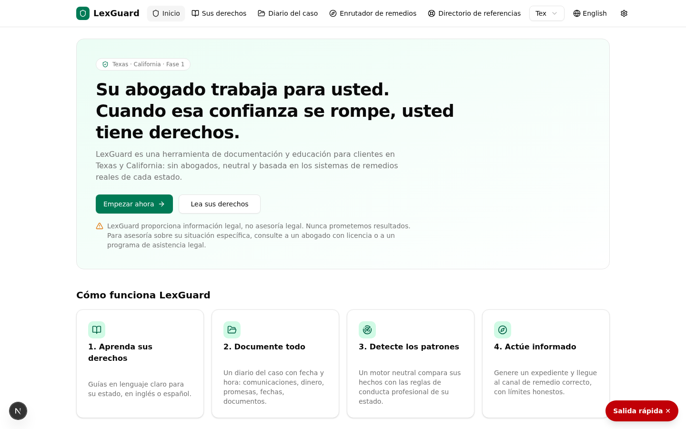
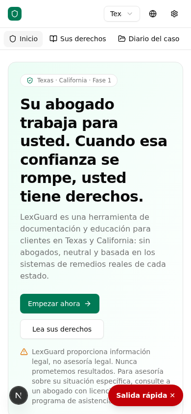

# LexGuard

**Client-side attorney accountability & case documentation platform — Texas & California (Phase 3)**

LexGuard is a lawyer-free web application that helps individuals dealing with (or who have dealt with) an attorney to:

1. **Understand their rights** as legal clients — in plain language, specific to their state (TX/CA), bilingual EN/ES.
2. **Document everything** — communications, payments, promises, documents, deadlines — in a structured, timestamped case journal.
3. **Detect potential misconduct patterns** through a neutral, rules-based red-flag engine that compares the client's facts against the Rules of Professional Conduct (20 rules, TX/CA citations).
4. **Act** — by generating a complaint-ready evidence dossier (PDF) and routing the user to the correct remedy channel: state bar discipline, Client Security Fund, fee arbitration/mediation, or malpractice referral.

> **Core thesis:** the machinery to hold attorneys accountable already exists (state bar discipline, Client Security Funds, fee arbitration). It fails mainly because victims don't know it exists and file vague, undocumented complaints. LexGuard fixes the information and documentation gap.

## Binding product principles

- **Neutral, professional, respectful tone at all times** — facts and rules, never accusations ("These facts may indicate a violation of Rule X…").
- **No named public accusations** — no attorney names displayed publicly, no "wall of shame", no user reviews.
- **Education first, action second** — every remedy channel explains what it *can* and *cannot* do before routing.
- **The client owns their data** — full JSON export and full deletion at any time.
- **No legal advice** — legal *information* only, with clear disclaimers and referrals (legal aid, bar referral services).
- **Do no harm** — persistent quick-exit button (triple-Esc shortcut), discreet mode, PIN lock, because users may share devices in family-law contexts.

## Feature overview

| Area | What's included |
|---|---|
| Case journal | Structured entries (communications, payments, promises, documents, deadlines); entries are immutable with visible edit markers |
| Red-flag engine | 20 deterministic, versioned rules (v1.0.0) mapped to TX/CA Rules of Professional Conduct; neutral bilingual templates; attorney sign-off status tracked honestly ("pending") |
| Remedy router | 4 channels × TX/CA with can/cannot-do lists, deadlines, exclusions, process steps, evidence checklists; TX privilege-waiver warning at the decision point |
| Rights guides | 10 guides × TX/CA state notes × EN/ES with last-reviewed dates |
| Dossier | Deterministic first-person narrative + print-ready PDF (7 sections, unbranded toggle, timeline/money/documents tables) |
| Storage modes | Account mode (server) **and** anonymous local Mode B (localStorage, 1 MB file cap with warning) |
| Safety | Quick exit (replaces history → weather site), discreet mode (tab title → "My Notes"), PIN lock with 10-min auto-lock |
| Privacy | 25 MB document cap, sha256 dedup, ownership-enforced downloads, count-only admin stats, full export + delete |
| i18n | Full English/Spanish parity across UI, guides, rules and router content |

### Phase 2 (public launch)

| Area | What's included |
|---|---|
| Deadline intelligence | Cross-case **Deadlines view**: user-set deadlines surfaced as overdue/upcoming, plus informational statutory windows computed from journal facts — CA Client Security Fund 4-year window from logged settlement receipt, TX CSF grievance-first conditions, TX/CA malpractice limitations info on engagement end. All neutral wording, all "verify on official pages" |
| Referral directory (FR-7) | 15 vetted TX/CA listings — LSC legal aid, bar referral services, law-school clinics, self-help, government victim-compensation programs — with phones, verified dates, search, kind filters, and a permanent no-paid-placement notice |
| Legal & trust pages | Privacy Policy, Terms of Use, Accessibility Statement (bilingual, draft-pending-counsel per PRD §9.2/§11), reachable from the footer |
| Age gate (PRD §9.2) | Neutral 16+ confirmation at registration, enforced in the UI and server-side |
| Accessibility (WCAG 2.1 AA) | Skip-to-content link, `aria-current` navigation, `<html lang>` synced to locale, `prefers-reduced-motion` support, semantic landmarks, labelled controls |

### Phase 3 (deepening)

| Area | What's included |
|---|---|
| Document text extraction | Client-side extraction on upload — PDFs via their embedded text layer (bundled pdf.js worker, offline-safe), photos/scans via on-device OCR (tesseract.js, English + Spanish). Only the resulting text is saved; files never leave the device in local mode |
| Global search | One search box over all cases, journal entries (incl. structured payloads), and documents (incl. extracted text), plus the rights guides. Deterministic accent-insensitive scoring with highlighted snippets; server-side in account mode (`/api/search`, ownership-scoped), in-browser in local mode |
| Quick log (mobile) | Bottom-left FAB → 8 structured templates (calls/emails in & out, money in & out, deadline, note) → ≤3-tap logging with the same payloads the red-flag engine consumes |
| Outcome tracking | Optional 30/90-day check-ins after a dossier export (PRD §14 action-rate metric): self-reported status + remedy channels, stored privately per user; admin sees anonymous counts only ("N of M exports reported action") |

## Screenshots

| Desktop | Mobile |
|---|---|
|  |  |

## Tech stack

- **Next.js 16** (App Router) + **TypeScript** + **Tailwind CSS**
- **Prisma** ORM with SQLite
- **Zustand** state management (dual storage adapters)
- **jsPDF** for dossier generation
- scrypt password hashing + HMAC-token sessions in httpOnly cookies
- Rules engine is fully deterministic — no LLM, no legal conclusions

## Getting started

```bash
# 1. Install dependencies
bun install        # or: npm install

# 2. Configure the database URL
echo 'DATABASE_URL=file:./db/custom.db' > .env

# 3. Push the Prisma schema
bunx prisma db push

# 4. Run the dev server
bun run dev        # or: npm run dev
```

Open `http://localhost:3000`. Onboarding lets you pick **account mode** or **anonymous local mode** (no server writes).

## Project structure

```
docs/                        PRD + screenshots
prisma/schema.prisma         Data model (User, Session, Case, Entry, Document, Dossier)
src/lib/lexguard/            Domain layer: rules.ts, engine.ts, channels.ts, guides-*.ts, i18n
src/app/api/                 Backend: auth, cases, entries, documents, dossiers, account, admin
src/components/lexguard/     UI views (single-page app at /)
```

## Scope & status

Phase 1 (TX + CA) MVP is implemented and browser-verified end to end (onboarding → journal → red flags → remedy routing → PDF dossier → bilingual toggle → safety features). **Phase 2 (public launch) adds the referral directory, deadline intelligence, legal/trust pages, the age gate, and the accessibility pass** — also browser-verified. **Phase 3 (deepening, PRD §13) adds document text extraction (PDF layer + on-device OCR), global search, mobile quick log, and 30/90-day outcome tracking** — all browser-verified in both storage modes. See `docs/LexGuard_PRD_TX_CA_v1.0.md` for the full product requirements, including explicit non-goals (no lawyer-facing features, no public ratings, no outcome promises).

## Legal disclaimer

LexGuard provides legal **information**, not legal **advice**, and is not a lawyer referral service. It does not evaluate the merits of any specific claim, does not guarantee any outcome, and is not affiliated with any state bar or government agency. Rules summaries are simplified for education; always consult the official rules and, where needed, a licensed attorney or legal aid organization.
