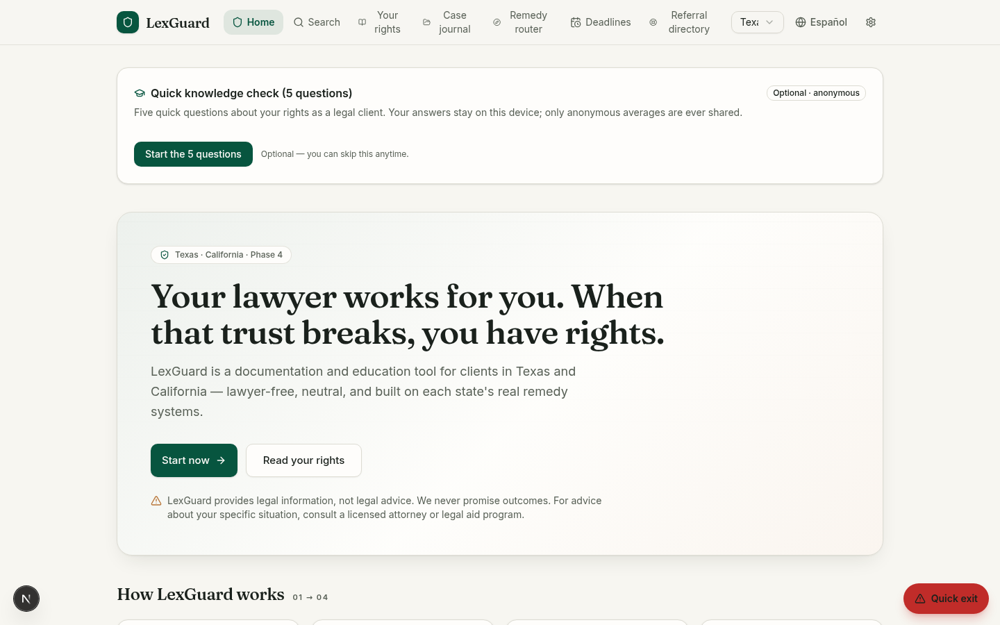
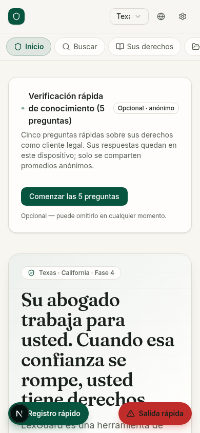

# LexGuard

**Client-side attorney accountability & case documentation platform — Texas, California, Florida, New York & Arizona (Phase 5)**

LexGuard is a lawyer-free web application that helps individuals dealing with (or who have dealt with) an attorney to:

1. **Understand their rights** as legal clients — in plain language, specific to their state (TX/CA launch; FL/NY/AZ expansion), bilingual EN/ES.
2. **Document everything** — communications, payments, promises, documents, deadlines — in a structured, timestamped case journal.
3. **Detect potential misconduct patterns** through a neutral, rules-based red-flag engine that compares the client's facts against the Rules of Professional Conduct (20 rules with per-state citations across TX/CA/FL/NY/AZ).
4. **Act** — by generating a complaint-ready evidence dossier (PDF) and routing the user to the correct remedy channel: state bar discipline, Client Security Fund, fee arbitration/mediation, or malpractice referral.

> **Core thesis:** the machinery to hold attorneys accountable already exists (state bar discipline, Client Security Funds, fee arbitration). It fails mainly because victims don't know it exists and file vague, undocumented complaints. LexGuard fixes the information and documentation gap.

## Binding product principles

- **Neutral, professional, respectful tone at all times** — facts and rules, never accusations ("These facts may indicate a violation of Rule X…").
- **No named public accusations** — no attorney names displayed publicly, no "wall of shame", no user reviews.
- **Education first, action second** — every remedy channel explains what it *can* and *cannot* do before routing.
- **The client owns their data** — full JSON export and full deletion at any time.
- **No legal advice** — legal *information* only, with clear disclaimers and referrals (legal aid, bar referral services).
- **Do no harm** — persistent quick-exit button (triple-Esc shortcut), discreet mode, PIN lock, because users may share devices in family-law contexts.

## Feature overview

| Area | What's included |
|---|---|
| Case journal | Structured entries (communications, payments, promises, documents, deadlines); entries are immutable with visible edit markers |
| Red-flag engine | 20 deterministic, versioned rules (v1.1.0) with per-state citations (TX/CA verified per PRD Appendix A; FL/NY/AZ verified from official sources 2026-09-10, attorney review pending); neutral bilingual templates; attorney sign-off status tracked honestly ("pending") |
| Remedy router | 4 channels × 5 states with can/cannot-do lists, deadlines, exclusions, process steps, evidence checklists; TX privilege-waiver warning at the decision point |
| Rights guides | 10 guides × 5-state notes × EN/ES with last-reviewed dates |
| Dossier | Deterministic first-person narrative + print-ready PDF (7 sections, unbranded toggle, timeline/money/documents tables) |
| Storage modes | Account mode (server) **and** anonymous local Mode B (localStorage, 1 MB file cap with warning) |
| Safety | Quick exit (replaces history → weather site), discreet mode (tab title → "My Notes"), PIN lock with 10-min auto-lock |
| Privacy | 25 MB document cap, sha256 dedup, ownership-enforced downloads, count-only admin stats, full export + delete |
| i18n | Full English/Spanish parity across UI, guides, rules and router content |

### Phase 2 (public launch)

| Area | What's included |
|---|---|
| Deadline intelligence | Cross-case **Deadlines view**: user-set deadlines surfaced as overdue/upcoming, plus informational statutory windows computed from journal facts — CA Client Security Fund 4-year window from logged settlement receipt, TX CSF grievance-first conditions, TX/CA malpractice limitations info on engagement end. All neutral wording, all "verify on official pages" |
| Referral directory (FR-7) | 15 vetted TX/CA listings — LSC legal aid, bar referral services, law-school clinics, self-help, government victim-compensation programs — with phones, verified dates, search, kind filters, and a permanent no-paid-placement notice |
| Legal & trust pages | Privacy Policy, Terms of Use, Accessibility Statement (bilingual, draft-pending-counsel per PRD §9.2/§11), reachable from the footer |
| Age gate (PRD §9.2) | Neutral 16+ confirmation at registration, enforced in the UI and server-side |
| Accessibility (WCAG 2.1 AA) | Skip-to-content link, `aria-current` navigation, `<html lang>` synced to locale, `prefers-reduced-motion` support, semantic landmarks, labelled controls |

### Phase 3 (deepening)

| Area | What's included |
|---|---|
| Document text extraction | Client-side extraction on upload — PDFs via their embedded text layer (bundled pdf.js worker, offline-safe), photos/scans via on-device OCR (tesseract.js, English + Spanish). Only the resulting text is saved; files never leave the device in local mode |
| Global search | One search box over all cases, journal entries (incl. structured payloads), and documents (incl. extracted text), plus the rights guides. Deterministic accent-insensitive scoring with highlighted snippets; server-side in account mode (`/api/search`, ownership-scoped), in-browser in local mode |
| Quick log (mobile) | Bottom-left FAB → 8 structured templates (calls/emails in & out, money in & out, deadline, note) → ≤3-tap logging with the same payloads the red-flag engine consumes |
| Outcome tracking | Optional 30/90-day check-ins after a dossier export (PRD §14 action-rate metric): self-reported status + remedy channels, stored privately per user; admin sees anonymous counts only ("N of M exports reported action") |

### Phase 4 (deferred items, now built)

| Area | What's included |
|---|---|
| Knowledge-lift quiz (§14) | Optional 5-question rights quiz, pre + a 7-day-later follow-up, with per-question explanations and rule citations. Answers stay on the device; account mode submits only the anonymous score (0–5, no identifier) — admin sees aggregate averages and the lift |
| Anonymized aggregate reporting (§13 Ph 4) | Admin dashboard reports documented-case pattern counts by category × state (trust/money, diligence, communication, authority/conflicts, fees) computed by the same deterministic engine, with **k-anonymity** — cells under 5 cases are never shown |
| Complaint-form worksheet (§13 Ph 4) | Maps the client's journal onto the actual state-bar form fields (TX Chief Disciplinary Counsel grievance / CA State Bar complaint): attorney & representation autofill, chronological facts, amounts, document index, and state-specific notices (TX privilege waiver, CA anonymity option) — appended to the dossier PDF and copyable as text. LexGuard never files |
| Zero-knowledge vault (§9.1) | Local mode can encrypt the entire journal at rest with a passphrase (WebCrypto AES-GCM, PBKDF2-SHA256 310k iterations). Passphrase never leaves the device; a reload seals the app behind an unlock screen; encrypted `.lgvault` backup download/restore included |
| Upload integrity scan (FR-2.4) | Client-side pre-upload checks: executable signatures masquerading as documents (blocked), EICAR test string (blocked), PDF active content and macro documents (warned), extension/MIME mismatches — all in neutral wording |
| Voice notes (FR-2.6) | Mic button in the journal and quick-log details fields via the Web Speech API (English/Spanish); hidden gracefully where unsupported |
| CA fee-arbitration directory (App. A) | County-level program listings (LA, SF, San Diego, Orange, Sacramento, Alameda, Santa Clara, Fresno + State Bar program for other counties) in the Remedy Router |
| Status page (§9.3) | `/status` public service page + `/api/health` machine-readable liveness endpoint |

## Screenshots

Design language — "The Docket": warm-paper surfaces, deep evergreen primary, copper accent,
Fraunces serif display headings over an Inter body, ruled-texture hero panels.

| Desktop | Mobile |
|---|---|
|  |  |

## Tech stack

- **Next.js 16** (App Router) + **TypeScript** + **Tailwind CSS**
- **Prisma** ORM with SQLite
- **Zustand** state management (dual storage adapters)
- **jsPDF** for dossier generation
- scrypt password hashing + HMAC-token sessions in httpOnly cookies
- Rules engine is fully deterministic — no LLM, no legal conclusions

## Getting started

```bash
# 1. Install dependencies
bun install        # or: npm install

# 2. Configure the database URL
echo 'DATABASE_URL=file:./db/custom.db' > .env

# 3. Push the Prisma schema
bunx prisma db push

# 4. Run the dev server
bun run dev        # or: npm run dev
```

Open `http://localhost:3000`. Onboarding lets you pick **account mode** or **anonymous local mode** (no server writes).

## Project structure

```
docs/                        PRD + screenshots
prisma/schema.prisma         Data model (User, Session, Case, Entry, Document, Dossier)
src/lib/lexguard/            Domain layer: rules.ts, engine.ts, channels.ts, guides-*.ts, i18n
src/app/api/                 Backend: auth, cases, entries, documents, dossiers, account, admin
src/components/lexguard/     UI views (single-page app at /)
```

## Scope & status

Phase 1 (TX + CA) MVP is implemented and browser-verified end to end (onboarding → journal → red flags → remedy routing → PDF dossier → bilingual toggle → safety features). **Phase 2 (public launch) adds the referral directory, deadline intelligence, legal/trust pages, the age gate, and the accessibility pass** — also browser-verified. **Phase 3 (deepening, PRD §13) adds document text extraction (PDF layer + on-device OCR), global search, mobile quick log, and 30/90-day outcome tracking** — all browser-verified in both storage modes. **Phase 4 implements the PRD's remaining buildable items: the knowledge-lift quiz, anonymized aggregate reporting with k-anonymity, the complaint-form worksheet, the zero-knowledge vault, upload integrity scanning, voice notes, CA county fee-arbitration listings, and the status page** — browser-verified in both storage modes and both languages. **Phase 5 completes the PRD's remaining buildable items:**
- **Multi-state expansion (FL/NY/AZ)** — remedy channels, complaint worksheets, client-protection-fund windows, guide notes, referral-directory listings, and rule citations verified from official public sources (see `docs/STATE_FACTS_PHASE5.md`); these states are clearly labeled "attorney review pending" in the product, and all TX/CA content is unchanged.
- **Calendar export (`.ics`)** — deadlines and statutory windows export as a standard RFC 5545 calendar file; the device's own calendar app handles reminders (a discreet, server-free answer to PRD Open Question 4).
- **Trash with 30-day recovery** — deleted cases (with all entries and documents) can be restored for 30 days, then are purged automatically; "delete forever" remains available (implements PRD Open Question 5's short soft-delete window).
- **Anonymous content reports** — "Report a content issue" on every guide and legal page; reports carry no user identity and feed an admin trust queue (PRD §14 trust metric).
- **Rules library governance** — the live 20-rule library exports as versioned JSON with a SHA-256 integrity hash; candidate libraries from the attorney-review workflow can be validated and diffed against the live library (PRD Open Question 2, FR-3.4). Still decision-gated per PRD: formal counsel sign-off for FL/NY/AZ content, email reminder digests (Open Question 4), soft-delete retention (Open Question 5), and rules-as-JSON authoring (Open Question 2 governance). See `docs/LexGuard_PRD_TX_CA_v1.0.md` for the full product requirements, including explicit non-goals (no lawyer-facing features, no public ratings, no outcome promises).

## Legal disclaimer

LexGuard provides legal **information**, not legal **advice**, and is not a lawyer referral service. It does not evaluate the merits of any specific claim, does not guarantee any outcome, and is not affiliated with any state bar or government agency. Rules summaries are simplified for education; always consult the official rules and, where needed, a licensed attorney or legal aid organization.
